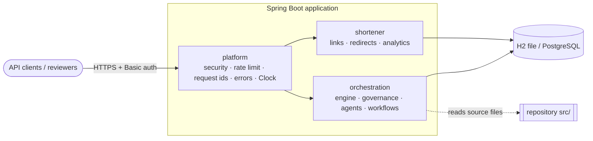
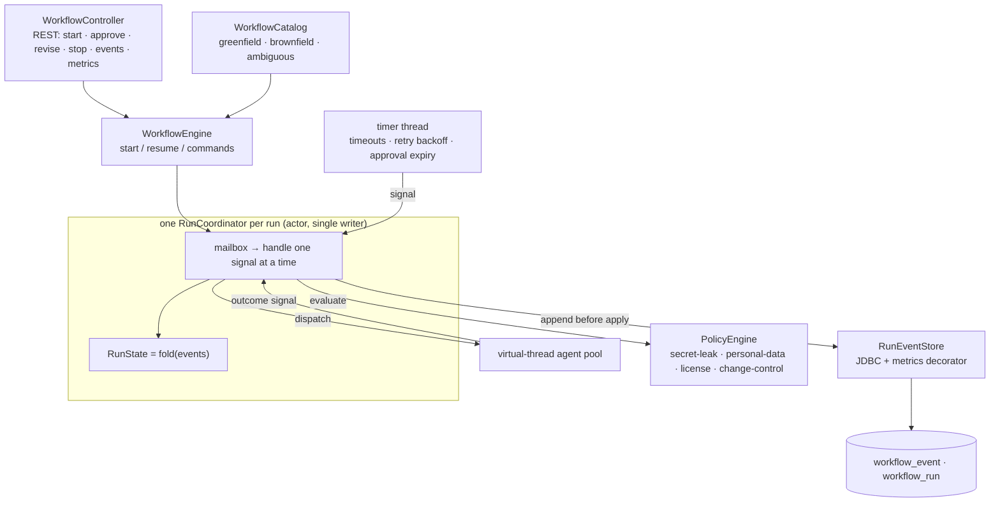
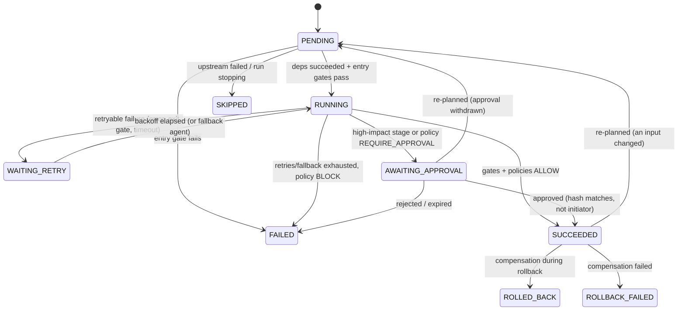

# Architecture

One Spring Boot 4 / Java 21 service containing two systems:

1. **A URL shortener**: a production-style service (create, redirect, analytics) with security
   controls, a cached hot path and asynchronous click recording.
2. **An agentic SDLC orchestrator** that takes a requirement through requirements → (impact
   analysis) → design → implementation → test plan ∥ security review → docs → release as a
   governed, event-sourced dependency graph. Agents propose; humans approve.

The orchestrator reasons about the shortener's real source code in brownfield runs, so the two
halves form one demonstrable whole.

## 1. Modules



| Module | Owns | May depend on |
|---|---|---|
| `platform` | Spring Security (RBAC), rate limiter, request-id filter, RFC 9457 errors, `Clock`, OpenAPI | nothing internal |
| `shortener` | `short_link`, `click_event`; REST API; cache; click pipeline | `platform` |
| `orchestration` | `workflow_run`, `workflow_event`; engine, governance, agents, workflows | `platform` |

`shortener` and `orchestration` never reference each other. The brownfield agent reads the
shortener's **source files** rather than its classes. Boundaries are enforced by `ArchitectureTest`
([ADR-0001](adr/0001-modular-monolith.md)).

## 2. URL shortener

### Redirect hot path ([ADR-0004](adr/0004-redirect-hot-path.md))

```mermaid
sequenceDiagram
    participant C as Client
    participant R as RedirectService
    participant K as RedirectCache (Caffeine)
    participant Q as ClickRecorder queue
    participant W as Batch writer (background)
    participant D as Database
    C->>R: GET /{code}
    R->>K: get(code)
    K-->>D: on miss: SELECT short_link
    R->>R: status at now() (expiry re-checked on every hit)
    R->>Q: offer(click) (non-blocking; full → drop + metric)
    R-->>C: 302 Location, Cache-Control: no-store
    W->>Q: drain ≤500 / 200 ms
    W->>D: INSERT click_events + 1 UPDATE per link (one tx)
```

- No database write on the request thread. A cached snapshot can never extend a link's life,
  because status is derived from timestamps on each request.
- Deactivation evicts the cache **after commit**.
- Click loss is bounded and visible: `shortener.clicks.dropped`, `shortener.clicks.failed`.

### Input safety and abuse ([ADR-0003](adr/0003-url-safety-without-dns.md))

- `http`/`https` only; no user-info.
- Private, loopback, link-local and reserved IPv4/IPv6 ranges are blocked, including
  `inet_aton` spellings such as `2130706433` and `0177.0.0.1`, plus IPv4-mapped and NAT64 forms.
- No DNS lookups.
- Token-bucket rate limit on link creation, applied before authentication.
- Random 7-char base62 codes with a database-enforced uniqueness constraint
  ([ADR-0002](adr/0002-random-short-codes.md)).

## 3. Orchestration model

### Components



**Why an actor per run** ([ADR-0005](adr/0005-orchestration-engine-actor-event-sourced.md)):
- **Single writer.** Only one thread mutates a run. Agents run in parallel but only *post*
  results; timers and humans also post signals. That gives no locks and no races between
  parallel stages, approvals, timeouts and stop requests.
- **Write-ahead events.** Every change is appended to the event store first, then applied.
  `RunState` is a pure, exhaustive fold over the sealed `RunEvent` type, so the audit trail
  *is* the state.
- **Request/reply commands.** Approve, revise and stop go through the mailbox with a reply
  future, so validation (pending? initiator? hash?) happens on the single writer.

### Stage lifecycle



### Run-level control flow

| Situation | Behaviour |
|---|---|
| Stages ready | Dispatch every stage whose dependencies all SUCCEEDED (fan-out); a stage with several dependencies waits for all of them (fan-in). |
| A stage fails terminally | **Fail fast**: start nothing new; in-flight stages finish and are recorded; queued retries and open approvals are withdrawn; pending stages are skipped; then **roll back** succeeded stages with compensations in reverse completion order → `FAILED`. |
| Policy BLOCK or operator stop | **Safe-stop**: same wind-down, but **no rollback** (state kept for investigation) → `STOPPED`. |
| Upstream output changes | **Re-plan**: stages whose recorded inputs (hash) are stale go back to PENDING; identical re-run output stops the cascade ([ADR-0008](adr/0008-replanning-and-reliability-metrics.md)). |
| Process dies | On startup, every `RUNNING` run is replayed; interrupted stages re-run as a new attempt; timers for retries and approvals are re-armed ([ADR-0006](adr/0006-durable-event-store-and-recovery.md), [ADR-0010](adr/0010-durability-of-committed-events.md)). |

### Governance ([ADR-0007](adr/0007-governance-controls.md))

| Control | Where | Rule |
|---|---|---|
| Entry and exit gates | every stage | Pure predicates; fail closed |
| Policies | every agent output **and** every human revision | Most severe of ALLOW / REQUIRE_APPROVAL / BLOCK; a throwing policy fails safe to REQUIRE_APPROVAL |
| Approval | high-impact stages + policy escalations | Bound to the artifact's SHA-256; never by the run's initiator; expires |
| Autonomy boundary | agent contract + ArchUnit | Agents get a read-only `StageContext` (ancestor artifacts only) and return proposals; they cannot reach engine, state or events |
| Retries / fallback / timeout | per stage `StagePolicy` | Bounded, exponential backoff; one fallback; late results of timed-out attempts discarded |

### Event model

`RunStarted · GateEvaluated · StageStarted · ArtifactProduced · DecisionRecorded · PolicyEvaluated ·
AttemptFailed · RetryScheduled · FallbackActivated · ApprovalRequested · ApprovalDecided ·
ArtifactRevised · StageInvalidated · StageSucceeded · StageFailed · StageSkipped · StopRequested ·
RollbackStarted · StageCompensated · RunResumed · RunCompleted`

Stored in `workflow_event` (append-only, primary key `run_id + seq`, JSON payload with
`schema_version`). Appends must continue `workflow_run.last_seq`, so a second writer is rejected.

### Agents ([ADR-0009](adr/0009-deterministic-agents-and-sdlc-workflows.md))

| Stage | Agent | Real logic |
|---|---|---|
| requirements | `requirements-analyst` | Acceptance-criteria extraction; vague-quality dictionary → question + testable assumption per ambiguity; change type FEATURE / BUG_FIX / REFACTOR |
| impact-analysis | `impact-analyzer` (fallback `impact-checklist`) | **Static analysis of the repository**: types, layers, imports (comments ignored), endpoints, tables, migrations, tests; module focus; blast radius; entity centrality; **data flows** from entry points to tables |
| clarification | `clarification-facilitator` | Packet of open questions and assumptions for the human checkpoint |
| design | `architect` | Brownfield feature: nullable column via next migration, API deltas. Bug fix: targeted, reproduce first, no schema change. Refactor: behaviour preserved. Greenfield: new module. Assumptions → design measures |
| implementation | `implementation-planner` | Proposed changeset + task DAG ordered by layer dependencies |
| test-plan ∥ security-review | `test-planner`, `security-reviewer` | Criterion → test coverage (unprovable criteria fail the gate); design/changeset security checklist |
| docs, release | `tech-writer`, `release-manager` | Changelog, ADR draft; semver bump, readiness checklist, rollout/rollback plan |

### Observability

- **Correlation.** Every log line carries `[req=… run=…]`, from `X-Request-Id` and the run id
  in agent threads.
- **Audit.** `GET /api/v1/runs/{id}/events` returns the complete ordered event log.
- **Reliability report.** `GET /api/v1/metrics` and `/runs/{id}/metrics` are computed from the
  log: success rate, retry and timeout rate, first-pass yield, rollback frequency, MTTR, latency
  percentiles, approval wait, human-intervention rate, re-planning counts.
- **Live meters.** `/actuator/metrics/orchestration.*` and `shortener.*` (ADMIN).

## 4. Data model

| Table | Owner | Notes |
|---|---|---|
| `short_link` | shortener | unique `code`; derived status; atomic `click_count`; optimistic `version` |
| `click_event` | shortener | no IP; referrer host only; `occurred_day` (UTC, computed in Java) |
| `workflow_run` | orchestration | read model, updated in the same transaction as each append |
| `workflow_event` | orchestration | source of truth, append-only |

Migrations V1–V4 are append-only. V2 and V3 illustrate the rule: V3 repairs V2's backfill
instead of editing it.

## 5. Security model

| Role | Users (demo) | Can |
|---|---|---|
| anonymous | – | create links, redirect, read link metadata and analytics, health, API docs |
| REQUESTER | alice | start runs, revise stage outputs |
| APPROVER | bob, carol | approve or reject checkpoints (never on runs they started) |
| ADMIN | admin | everything above, deactivate links, safe-stop runs, actuator metrics |

Deny by default. Stateless HTTP Basic (CSRF not applicable), bcrypt hashes, CSP and other security
headers. In production the users come from an identity provider via OIDC, which is a
configuration change.

## 6. Key decisions

| ADR | Decision |
|---|---|
| [0001](adr/0001-modular-monolith.md) | Modular monolith with machine-checked boundaries |
| [0002](adr/0002-random-short-codes.md) | Random codes + database-enforced uniqueness + bounded retry |
| [0003](adr/0003-url-safety-without-dns.md) | Syntactic URL safety, no DNS |
| [0004](adr/0004-redirect-hot-path.md) | Read-through cache + async batched clicks |
| [0005](adr/0005-orchestration-engine-actor-event-sourced.md) | Actor per run, event-sourced state |
| [0006](adr/0006-durable-event-store-and-recovery.md) | Durable event store, single writer, crash recovery |
| [0007](adr/0007-governance-controls.md) | Approvals, policies, retries, rollback, safe-stop |
| [0008](adr/0008-replanning-and-reliability-metrics.md) | Hash-based re-planning, log-derived metrics |
| [0009](adr/0009-deterministic-agents-and-sdlc-workflows.md) | Deterministic agents; three SDLC workflows |
| [0010](adr/0010-durability-of-committed-events.md) | Committed events survive a hard crash |
