# Requirements Analysis

This document turns the assignment brief into an engineering problem we can build and verify.
It lists the ambiguities we found, the decisions we made about them, and the task plan that the rest of the repo follows.

---

## 1. Problem statement

Build two things in one deployable Spring Boot service:

1. **A URL shortener**: a small production-style HTTP service that creates short links, redirects them, and reports click analytics, with input validation and abuse protection.
2. **An agentic SDLC orchestrator**: an engine that takes a requirement (greenfield, brownfield or ambiguous) and drives it through requirements → design → implementation → testing → documentation → release. It runs as a governed, stateful dependency graph: agents do the work, and humans approve high-impact steps.

Part 2 is what the brief calls the *critical differentiator*. Part 1 is the realistic system the orchestrator reasons about.

---

## 2. URL shortener requirements

### 2.1 Functional

| ID | Requirement |
|----|-------------|
| FR-1 | `POST /api/v1/urls` creates a short link from a long URL. Optional: `customAlias`, `expiresAt`. Returns `201` with the code and full short URL. |
| FR-2 | `GET /{code}` redirects to the original URL with `302 Found`. |
| FR-3 | Unknown code → `404`. Expired or deactivated link → `410 Gone`. |
| FR-4 | `GET /api/v1/urls/{code}` returns link metadata. |
| FR-5 | `GET /api/v1/urls/{code}/analytics` returns total clicks, last access time, clicks per day, and top referrers. |
| FR-6 | `DELETE /api/v1/urls/{code}` deactivates a link (soft delete, kept for audit). |
| FR-7 | Every successful redirect records a click event. |

### 2.2 Non-functional

| ID | Requirement |
|----|-------------|
| NFR-1 | **Security:** only `http`/`https` URLs. Reject `javascript:`, `data:`, `file:` and similar schemes. Reject localhost and private/loopback/link-local IP hosts (stops the shortener being used to hide internal addresses). Max URL length 2048. |
| NFR-2 | **Security:** short codes are random (`SecureRandom`, base62, 7 chars ≈ 3.5 × 10¹² space), so links can't be enumerated by counting. |
| NFR-3 | **Reliability:** collisions are retried a bounded number of times. Click counting uses an atomic DB update (no lost updates under concurrency). |
| NFR-4 | **Reliability:** per-client rate limit on link creation. `429` with `Retry-After` when exceeded. |
| NFR-5 | **Consistency:** all errors use one JSON shape (RFC 9457 `ProblemDetail`). |
| NFR-6 | **Privacy:** click events never store raw IP addresses. Only timestamp, referrer host and a coarse user-agent family. |
| NFR-7 | **Operability:** health and metrics through Spring Boot Actuator. |
| NFR-8 | **Portability:** JPA over H2 for zero-setup local runs. Swapping in Postgres is a config change, not a code change. Schema is owned by versioned Flyway migrations; Hibernate only validates it. |
| NFR-9 | **Performance:** redirect lookups go through an in-process cache (Caffeine) with bounded size and TTL. Cache entries are evicted on deactivation. |
| NFR-10 | **Performance:** click recording is asynchronous and off the redirect path, through a bounded queue. If the queue is full, the click is dropped and counted in a metric. Redirect latency is never sacrificed to analytics. |
| NFR-11 | **Access control:** role-based (`REQUESTER`, `APPROVER`, `ADMIN`). Creating links and following redirects is public. Deactivating links, starting workflows and approving checkpoints need an authenticated user with the right role. |
| NFR-12 | **API contract:** OpenAPI 3 spec generated from the code, served at `/v3/api-docs`, with Swagger UI. |

---

## 3. Orchestrator requirements

Each clause of brief §4.4 is mapped to a testable requirement.

| ID | Brief clause | Requirement |
|----|-------------|-------------|
| OR-1 | "explicit dependency graph" | Workflows are a DAG of stages declared up front. Cycles are rejected at build time. |
| OR-2 | "entry/exit gates" | Each stage has an entry gate (preconditions on context) and an exit gate (checks on its output). A failed exit gate counts as a stage failure. |
| OR-3 | "sequential and parallel paths with synchronization" | Independent stages run concurrently. A stage starts only when **all** its dependencies have succeeded (join). |
| OR-4 | "cross-stage context and decision lineage" | One shared, versioned context per run. Every agent decision is recorded with stage, rationale and the inputs it was based on. |
| OR-5 | "human approval checkpoints for high-impact actions" | Stages flagged high-impact, or flagged by policy, pause the run in `AWAITING_APPROVAL` until a human approves or rejects through the API. |
| OR-6 | "bounded retries, fallback" | Per-stage retry policy (max attempts, backoff). After retries are used up, an optional fallback agent runs. |
| OR-7 | "rollback" | Each stage can define a compensating action. On terminal failure, completed stages are rolled back in reverse order. |
| OR-8 | "safe-stop" | A blocking policy violation, or a manual stop request, halts the run cleanly: no new stages start, in-flight ones finish, state is kept. |
| OR-9 | "policy guardrails: security, compliance, change control" | A pluggable policy engine evaluates every stage output. Results: `ALLOW`, `REQUIRE_APPROVAL` or `BLOCK`. |
| OR-10 | "audit-grade observability and traceability" | Append-only audit log of every state transition, decision, policy result and approval, with run ID, stage, actor and timestamp. Queryable per run. |
| OR-11 | "reliability metrics" | Success rate, retry frequency, rollback frequency, MTTR (failure → recovery) and end-to-end latency, both per run and aggregated. |
| OR-12 | "dynamically re-plan when upstream outputs change" | When a stage's output changes (e.g. after a human revises requirements), its content hash is compared to the previous one. Only downstream stages whose inputs actually changed are invalidated and re-executed. The re-plan is recorded in lineage. |
| OR-13 | "controlled agent autonomy" | Agents only *propose* (artifacts, changesets). They never apply changes or release on their own. Release always needs human approval. |
| OR-14 | "human approval … governance" | Approvals are bound to the content hash of the artifact being approved. If the artifact changes, the approval is void. Separation of duties: the user who started a run cannot approve its checkpoints. Pending approvals expire after a configurable timeout, and expiry rejects them. |
| OR-15 | "audit-grade … stateful execution" | Runs are **event-sourced**. An append-only event log in the database is the source of truth, and run state is rebuilt by replaying it. After a restart, runs that were waiting for approval are restored and can resume. |
| OR-16 | "bounded … safe-stop" | Every stage has an execution timeout. A timeout counts as a failed attempt (it is retried). Safe-stop cancels in-flight stages cooperatively. |
| OR-17 | "codebase reasoning (brownfield)" | The impact-analysis agent does **real** static analysis: it parses this repository's Java sources, builds a package/class dependency graph, and works out which modules, APIs and tables a change touches. |

---

## 4. Ambiguities and decisions

The brief and a typical "URL shortener" spec leave these questions open. Each decision is deliberate and can be revisited.

| # | Ambiguity | Decision | Rationale |
|---|-----------|----------|-----------|
| A-1 | Should shortening the same URL twice return the same code? | **No.** Each request gets a new code. | Different links for the same target are a common need (campaigns). Deduplication would also reveal that someone else already shortened a URL. |
| A-2 | 301 or 302 redirect? | **302.** | Browsers cache 301s, so repeat clicks would never reach us and analytics would undercount. |
| A-3 | What is a "click"? | Every successful redirect. No unique-visitor dedupe. | Deduping needs tracking identifiers, which conflicts with NFR-6. Documented as a limitation. |
| A-4 | Expiry semantics | Optional absolute `expiresAt`. Must be in the future and ≤ 1 year ahead. No expiry means the link never expires. | Simple and unambiguous. Relative TTLs can be added on the client side. |
| A-5 | Custom alias rules | 3–30 chars of `[A-Za-z0-9_-]`. Case-sensitive. Reserved words (`api`, `actuator`, `h2-console`, …) rejected. Conflict → `409`. | Stops aliases from shadowing system routes. |
| A-6 | Should we check that the target URL is reachable? | **No.** We validate syntax and host only. We never fetch the URL. | Fetching user-supplied URLs is an SSRF risk and adds latency. |
| A-7 | Authentication / ownership of links | **Role-based access with in-memory users and HTTP Basic** (NFR-11). Link creation stays anonymous. Per-user link ownership is out of scope. | Governance (approvals, audit actors) is meaningless without identity. A real deployment would swap in OIDC/SSO; Spring Security makes that a configuration change. |
| A-8 | What are the "agents"? | Deterministic Java classes behind an `Agent` interface (simulated). | Runnable without API keys, reproducible, testable. The interface is the seam where an LLM-backed agent would plug in. |
| A-9 | Does the orchestrator modify real code? | **No.** Agents produce *proposed* artifacts and changesets. The brownfield design agent does read the real source tree to work out impact. | Controlled autonomy (OR-13). Running generated code would need sandboxing that is out of scope. |
| A-10 | Persistence of workflow state | **Event-sourced, stored in the database** (OR-15). | One mechanism covers audit, traceability, replay and crash recovery, with no separate audit store to keep in sync. |
| A-11 | Redirect cache consistency | Cache with a short TTL, explicitly evicted on deactivate. Single instance assumed. | Correct for one node. With several instances, deactivation could be served stale for up to one TTL. Documented, with Redis/pub-sub as the scale-out path. |
| A-12 | Click loss under load | Dropping clicks is acceptable when the queue is full. Losing clicks on shutdown is limited by draining the queue. | Analytics is approximate by nature. Redirect availability matters more. The drop counter makes the loss visible rather than silent. |
| A-13 | How "real" are the simulated agents? | Rule-based where real logic is feasible (ambiguity detection, static impact analysis, secret/policy scanning). Scripted outputs only where real work would mean running an LLM or compiling generated code. | Gets as much real behavior as possible while staying deterministic and testable. |

---

## 5. Task decomposition

Tasks in implementation order. Arrows are hard dependencies.

```mermaid
graph LR
  T1[T1 Requirements doc] --> T2[T2 Platform: Flyway, security, OpenAPI, CI]
  T2 --> T3[T3 Shortener domain, codes, URL validation]
  T3 --> T4[T4 Shortener API, cache, async clicks, rate limit]
  T2 --> T5[T5 Orchestrator core: DAG, context, parallel executor]
  T5 --> T6[T6 Event store + audit + run recovery]
  T6 --> T7[T7 Governance: policies, approvals, retries, rollback, safe-stop]
  T7 --> T8[T8 Metrics + re-planning]
  T8 --> T9[T9 Agents incl. static impact analysis]
  T4 --> T10[T10 Scenarios: greenfield / brownfield / ambiguous]
  T9 --> T10
  T10 --> T11[T11 Integration + architecture tests]
  T11 --> T12[T12 Docs: README, architecture, ADRs, scenarios, summary]
  T12 --> T13[T13 Publish to GitHub]
```

T3–T4 (shortener) and T5–T9 (orchestrator) are independent tracks that join at T10. Unit tests are written alongside each task. T11 is the end-to-end and architecture-rule pass.

---

## 5a. Engineering standards

- **Architecture Decision Records** in `docs/adr/`, one per significant decision, in the standard Context / Decision / Consequences format.
- **ArchUnit tests** enforce module boundaries. `orchestration` must not depend on `shortener`, and controllers must not touch repositories directly.
- **CI** (GitHub Actions) runs the full build and test suite on every push and pull request.
- **Structured logging** with the run ID and request ID in the logging context (MDC), so every log line can be traced.
- **Java 21 virtual threads** for parallel stage execution.

---

## 6. Acceptance criteria

- `./mvnw test` passes from a clean clone with only JDK 21 installed.
- `./mvnw spring-boot:run` starts the service. Every FR above can be exercised with `curl`.
- Each of the three scenarios can be started with one API call and visibly shows: decomposition, parallel execution, a policy decision, an approval checkpoint, and validation results in its audit trail.
- Failure handling (retry → fallback → rollback, and safe-stop) is covered by automated tests that inject failures deterministically.
- Every OR-x requirement is covered by at least one named test.
- Restarting the app while a run is waiting for approval keeps the run, and it can still be approved and completed.
- Approval by the run's own initiator is refused. Approval of a changed artifact is refused.
- CI is green on GitHub, and ArchUnit rules pass.

## 7. Out of scope

SSO/OIDC (we use in-memory users), per-user link ownership, multi-instance deployment (distributed cache, rate limiting and event store), a UI, real LLM calls, and message brokers. Each is deliberately left out. The engineering summary explains at what point each would become worth adding.
