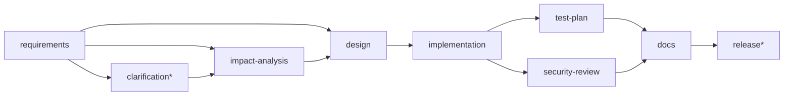

# Scenarios: greenfield, brownfield, ambiguous

Each scenario is runnable two ways:

- **Live:** `./scripts/demo.sh greenfield` (or `brownfield`, `ambiguous`) against a running app.
- **Automated:** `ScenarioIntegrationTest` (real agents, policies, database and approvals).

The outputs quoted below are from an actual demo run, not illustrations.

All three share the delivery pipeline and differ in what happens before design (\* = human checkpoint):



| Workflow | Path before design |
|---|---|
| `greenfield-feature` | requirements → design |
| `brownfield-change` | requirements → impact-analysis → design |
| `ambiguous-requirement` | requirements → **clarification\*** → impact-analysis → design |

---

## 1. Greenfield: a new capability from a well-defined requirement

> **QR codes for short links.** *Users must be able to download a QR code for any short link.
> The QR image must be a PNG of 300x300 pixels. Requesting a QR code for an unknown link must
> return 404.*

**Decomposition**
- `requirements-analyst`: 3 acceptance criteria, no ambiguities → `WELL_DEFINED`. Keywords
  keep the acronym (`qr`, `code`, …).
- `architect`: new module `qrcode` in the house layering, plus the initial migration.
- `implementation-planner`: changeset of 5 files plus a task plan ordered by dependencies:

```
T-1 Add V1__create_qrcode_tables.sql (migration)  ← needs []
T-2 Add QrCode (entity)                           ← needs [T-1]
T-3 Add QrCodeRepository (repository)             ← needs [T-1, T-2]
T-4 Add QrCodeService (service)                   ← needs [T-1, T-2, T-3]
T-5 Add QrCodeController (controller)             ← needs [T-1, T-2, T-3, T-4]
```

**Orchestration**
- Sequential through implementation.
- Then **test-plan and security-review in parallel**, joining at docs. The test asserts docs
  started only after both succeeded.
- Checkpoints raised:
  1. `implementation`, raised by **policy**: `CHANGE_CONTROL/change-control: schema change …V1__create_qrcode_tables.sql`
  2. `release`, raised by **stage definition**: `high-impact stage: production release`
- Result: `SUCCEEDED`, 7/7 stages, 70 audit events.

**Validation**
- Exit gates: requirements has criteria; design has components; implementation has changes;
  every criterion has a test.
- Release entry gate: no HIGH security findings.
- `release-manager`: `MINOR` bump (additive API and schema); readiness checklist all PASS.

---

## 2. Brownfield: change the existing shortener, reasoning over this repository

> **Add per-link click limits.** *Each short link can have an optional maximum number of clicks.
> Once the limit is reached, the link must stop redirecting and return 410 Gone. The limit must
> be set when the link is created.*

**Codebase reasoning:** `impact-analyzer` statically analyses the running service's own source:

```
module ["shortener"], tables ["short_link"], next migration V5, risk MEDIUM
seeds ["ShortLink","ShortLinkController","ShortLinkService","ShortLinkRepository","RedirectService"]
scanned 128 types / 356 dependency edges
```

- It chose the **module** first, so "limit" did not pull in the platform's rate limiter. That
  is tested separately: a rate-limiting requirement lands in `platform`.
- The blast radius covers controllers, services, the cache and the click pipeline, plus the
  `ShortLink` entity they operate on.
- Tables are ordered by entity centrality: the attribute goes on `short_link`, not `click_event`.
- Existing tests that cover the impacted code (e.g. `ShortenerApiIntegrationTest`) become the
  regression suite.

**Decomposition**
- `architect`: `ALTER TABLE short_link ADD COLUMN click_limit BIGINT` in
  `V5__add_click_limit_to_short_link.sql`. The column is **nullable**, so it is backward
  compatible (expand/contract). API deltas: `POST /api/v1/urls` accepts the field;
  `GET /{code}` gains a 410 outcome.
- `security-reviewer`: MEDIUM (validate the new write field); LOW (additive migration).

**Orchestration**
- Impact analysis has retries (2), a 60 s timeout, and a **fallback** (`impact-checklist`) if the
  source tree is unavailable. The fallback degrades to "manual review, risk HIGH", never to a guess.
- Checkpoints raised:
  1. `implementation`: `schema change …V5__add_click_limit_to_short_link.sql`
  2. `release`
- Result: `SUCCEEDED`, 8/8 stages, 81 audit events.

**Crash and recovery (live).** The same run was killed with `kill -9` while waiting at the
implementation checkpoint. After restart:
- the log shows `Resumed run 7a635f09… (brownfield-change v1)`
- bob approved **the same approval id** on the new process
- the run completed, with implementation not redone (attempts = 1)

That also uncovered a durability bug, fixed in [ADR-0010](adr/0010-durability-of-committed-events.md).

---

## 3. Ambiguous: clarify before building, then re-plan from the human's answer

> **Make the URL shortener faster and more reliable.** *(no description)*

**Requirement understanding**
- `requirements-analyst` → `AMBIGUOUS` (clarity 0.5). It produces one question and one testable
  default assumption per ambiguity:

```
? Q-1 [faster]   What latency target applies (e.g. p95 in ms) and at what request rate?
? Q-2 [reliable] What availability target applies, and which failures must be tolerated?
? Q-3 [(none)]   What observable behaviour proves this is done? No 'must/should' statements were found.
  A-1 Redirect p95 latency <= 50 ms at 200 requests/s on a single instance
  A-2 99.9% monthly availability; no data loss for created links; …
```

**Controlled autonomy**
- The run stops at the `clarification` checkpoint.
- `impact-analysis` stays `PENDING`: nothing is built on unconfirmed assumptions.

**Human input and re-planning.** The product owner does not just approve the assumptions; they
**revise the requirements artifact** with concrete targets:

```
AC-1 Redirect p95 latency must be below 50 ms at 200 requests/s
AC-2 Redirects must keep working when analytics storage is unavailable
```

1. The revision passes the same **policies** as agent output. A pasted secret would be refused
   with `422 REVISION_BLOCKED_BY_POLICY`.
2. The clarification output was derived from the old requirements hash, so it is **stale**. Its
   approval is **WITHDRAWN** and the stage re-runs.
3. A **new checkpoint** is raised for the revised content (new hash, so a new approval is needed).
4. After approval, impact analysis and design run on confirmed facts
   (`design.basedOnAssumptions = []`).
5. Result: `SUCCEEDED`, 106 audit events. Run metrics show `revisions: 1`, `invalidations: 1`,
   and at least one withdrawn approval.

**Why this matters:** the alternative (agents guessing and proceeding) is exactly what the brief
warns against. Here the ambiguity is made explicit, the human decides, and the system re-plans
precisely from that decision.

---

## Governance refusals (demo section 5)

| Attempt | Result |
|---|---|
| alice (REQUESTER) approves a checkpoint | `403` (role) |
| admin approves with a hash of something else | `409 STALE_APPROVAL` |
| admin approves a run admin started | `403 SELF_APPROVAL_FORBIDDEN` (holding every role doesn't help) |
| bob (APPROVER) safe-stops a run | `403` (ADMIN only) |
| admin safe-stops | `202` → run `STOPPED`, open approvals withdrawn, no rollback |
